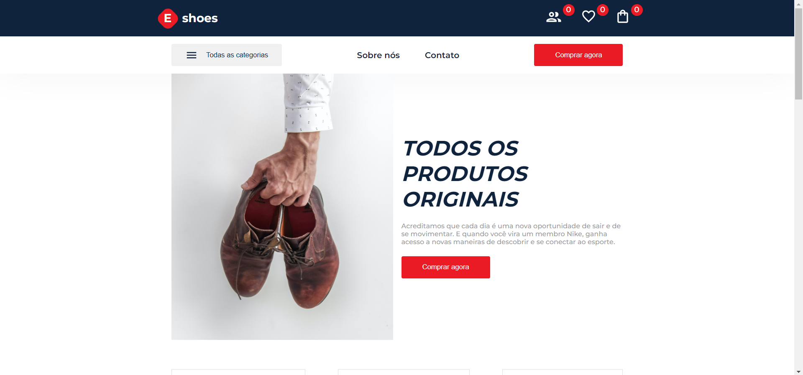

<h1 align="center">
   
    Eshoes
   
</h1>

Marketplace de tênis. Foi criado no desafio da Hiring coders#2.

  

    

 

## :hammer: Tecnologias

Este projeto foi desenvolvido com as seguintes tecnologias:

- HTML
- CSS
- React
- TypeScript
- Sass

## 🚀 Execute o projeto

1. Clone este repositório `git clone https://github.com/dudunog/eshoes-website.git`
2. Entre no diretório do projeto `cd eshoes-website`
3. Instale as dependências com `yarn install` ou `npm install`
4. Inicie o projeto em modo desenvolvimento com `yarn run dev` ou `npm run dev`
